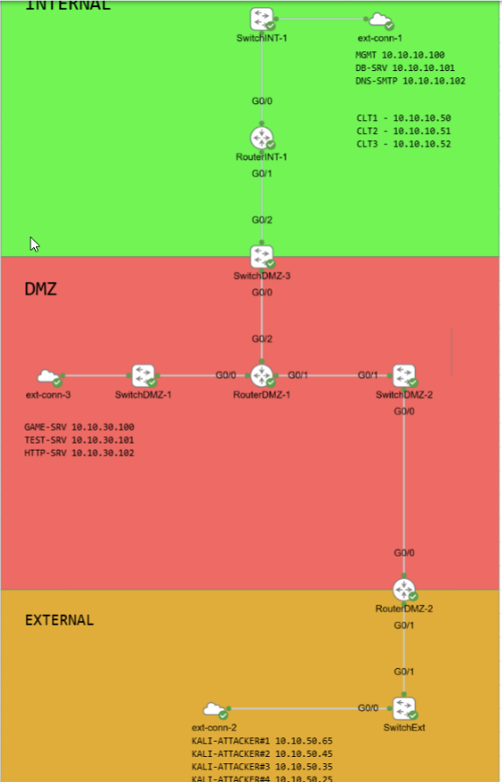
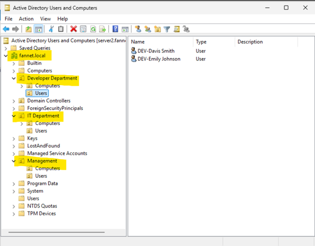
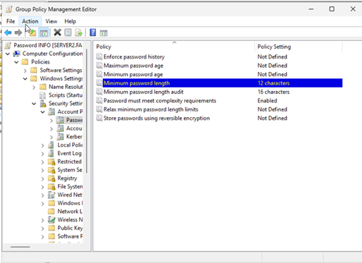
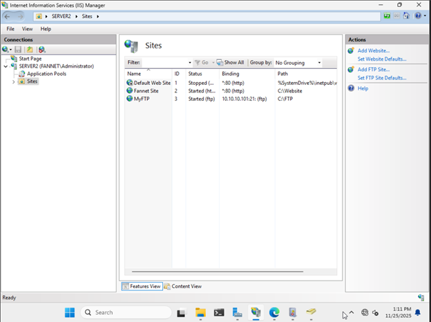
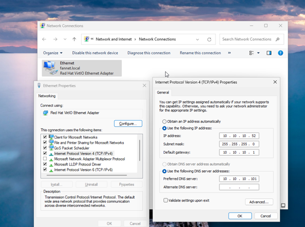
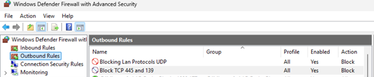
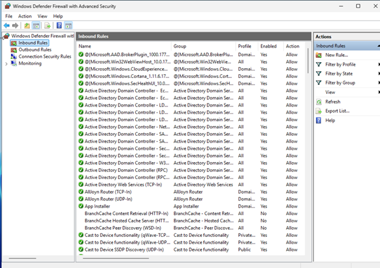
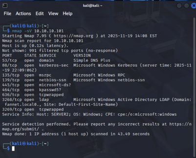
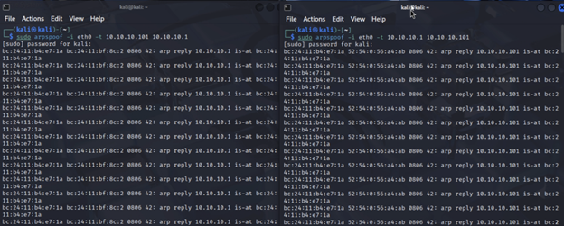

# Enterprise Network & Active Directory Security Lab

## Overview

This project involved designing, configuring, and securing a simulated enterprise
network environment for a fictional gaming company called FanNet.

The original environment used a flat network with limited security controls.
The goal of the project was to improve the network architecture, implement
centralized user management, configure core network services, strengthen access
controls, and test the environment against common network and application attacks.

This was completed as a team-based academic project at Fanshawe College.
## Network Architecture

The lab environment was segmented into three primary security zones: **Internal, DMZ, and External**. This design separated internal systems from public-facing services and the external attack/testing environment.

## Technologies & Tools

- Windows Server
- Active Directory Domain Services (AD DS)
- Group Policy
- DNS
- DHCP
- IIS
- Windows Defender Firewall
- Kali Linux
- Nmap
- Wireshark
- GNS3
- Python
- Hydra
- hping3
- arpspoof

## Lab Objectives

- Improve the security of a flat network architecture
- Configure centralized user and access management
- Implement role-based access controls
- Configure DNS and DHCP services
- Apply Group Policy security settings
- Configure firewall rules and access controls
- Reduce unnecessary network exposure
- Enable security logging and auditing
- Test the environment against common attack scenarios
- Implement defensive controls and document remediation

## Active Directory & Access Control

Active Directory was used to provide centralized identity and access management.

The environment included:

- Domain user accounts
- User groups and organizational roles
- Role-based permissions
- Principle of least privilege
- Group Policy Objects (GPOs)
- Password security policies
### Active Directory Organizational Structure

Active Directory was configured for the `fannet.local` domain with organizational units representing different business departments, including Development, IT, and Management. User and computer accounts were organized by department to support centralized administration and role-based access control.

Group Policy was used to strengthen account security and enforce password
requirements across domain-connected systems.
### Group Policy – Password Security

Group Policy was used to enforce domain password security requirements. The lab configuration included a minimum password length of 12 characters and enabled password complexity requirements.

## DNS, DHCP & Server Configuration

Core network services were configured to provide connectivity and resource access
within the environment.

The lab included:

- DNS configuration for hostname resolution
- DHCP configuration for automatic IP addressing
- Windows Server configuration
- IIS web server configuration
- Client connectivity and name-resolution testing

These services were tested to verify that clients could obtain network
configuration, resolve names, and access network resources.
### IIS Web & FTP Server Configuration

IIS was configured on Windows Server to host the FanNet website and an FTP service. The lab included configuring site bindings and validating access to the hosted services.

### Client Network & DNS Configuration

Windows client systems were configured with IPv4 addressing, a default gateway, and the internal DNS server to support connectivity and name resolution within the FanNet environment.

## Network Security & Hardening

Several defensive controls were implemented to reduce the attack surface.

These included:

- Changing default router and switch credentials
- Disabling unnecessary ports and services
- Configuring Windows Defender Firewall
- Implementing network access-control rules
- Applying role-based access controls
- Strengthening password policies
- Enabling system logging and auditing
### Windows Defender Firewall Configuration

Windows Defender Firewall with Advanced Security was used to manage inbound and outbound network traffic. Custom outbound rules were configured to block unnecessary or higher-risk network services, while inbound rules were reviewed to support required services such as Active Directory.

#### Outbound Security Rules

#### Inbound Firewall Rules

## Security Testing

The environment was tested against several attack scenarios in a controlled
academic lab.

### Network Reconnaissance

Nmap was used to identify hosts, services, and exposed ports.

Wireshark was used to inspect network traffic and analyze communication between
systems.
#### Nmap Service Discovery

Nmap was used to perform service discovery against systems in the lab environment. The scan identified exposed Windows services including DNS, Kerberos, RPC, SMB, and LDAP, providing visibility into the services available on the target system.

### Man-in-the-Middle Testing

ARP spoofing was demonstrated in the controlled environment to understand how
unauthenticated ARP communication can allow traffic interception.

The exercise helped demonstrate the importance of network segmentation,
monitoring, and secure network configuration.
#### ARP Spoofing Demonstration

ARP spoofing was performed in the isolated lab environment to demonstrate how manipulated ARP responses can position an attacker between network systems and potentially enable traffic interception.

### Authentication Testing

A controlled FTP password attack was demonstrated using Hydra with a
lab-generated wordlist.

This demonstrated the risk of weak credentials and exposed authentication
services.

### Web Application Security

A deliberately vulnerable web application was used to demonstrate SQL injection
and the risks associated with passing unsanitized user input to database queries.

### SYN Flood Testing

hping3 was used in the isolated lab to demonstrate how large numbers of
incomplete TCP connections can affect server availability.

Wireshark was used to observe the resulting network traffic.

## Defensive Improvements

Following testing, several security improvements were evaluated or implemented:

- Stronger password policies
- Role-based access control
- Network segmentation
- Firewall and ACL configuration
- Removal of unnecessary services
- Improved logging and auditing
- Server and endpoint hardening
- Protection against common network attacks

## Skills Demonstrated

This project provided hands-on experience with:

- Windows Server administration
- Active Directory
- User and group management
- Group Policy
- DNS and DHCP
- TCP/IP networking
- Network troubleshooting
- Firewall configuration
- Network traffic analysis
- Security testing
- System hardening
- Technical documentation

## Project Context

This project was completed as part of my Cybersecurity Advanced Diploma at
Fanshawe College.

The project was completed in a team environment and involved designing,
testing, securing, and documenting a simulated enterprise network.

All security testing was performed in an isolated academic lab environment.
